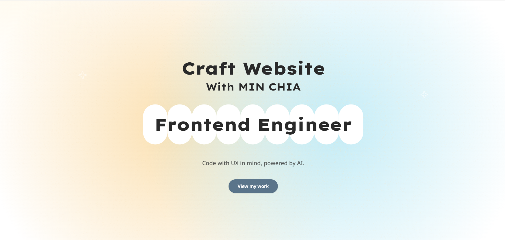

# MIN CHIA — Portfolio

A personal frontend portfolio built with Astro islands, React, and Tailwind CSS v4 — static-first, content-driven, and tuned for fast loads.

[](https://astro.build)
[](https://react.dev)
[](https://tailwindcss.com)
[](https://www.typescriptlang.org)

🚀 **Live Demo:** [https://minchia-portfolio.vercel.app/](https://minchia-portfolio.vercel.app/)



## 👋 Overview

This site is a static Astro portfolio with selective React hydration. Project entries live in an Astro content collection, so adding or updating case studies is a Markdown + frontmatter change — no page wiring required. Interactive UI (theme toggle, scroll-spy nav, pointer glow) is isolated into islands and only hydrated when the matching media query matches. Theming uses Tailwind CSS v4’s CSS-first `@theme` tokens with a class-based light/dark system and no FOUC.

## ✨ Features

- Content-collection-driven projects with Zod-validated frontmatter (`src/content.config.ts`)
- Statically generated detail pages via `getStaticPaths()` (`src/pages/projects/[slug].astro`)
- Dark mode with no FOUC — inline pre-paint theme script in `src/layouts/Layout.astro`
- Scroll-spy navigation via IntersectionObserver (`src/lib/useActiveSection.ts`) — desktop section dots + mobile bottom bar
- Pointer-following spring glow with Motion (`src/components/layout/MouseGlow.tsx`)
- Base UI + CVA primitives (`button.tsx`, `badge.tsx`) with a `cn()` merge helper
- SEO basics: meta description, canonical URL, Open Graph title/description/url

## 🧰 Tech Stack

- **Framework:** Astro 7, React 19 (islands), TypeScript
- **UI:** Base UI (`@base-ui/react`), Lucide icons, CVA + `clsx` + `tailwind-merge`
- **Styling:** Tailwind CSS v4 (CSS-first via `@tailwindcss/vite`), `@tailwindcss/typography`, `tw-animate-css`, shadcn Tailwind preset
- **Fonts:** Lexend Exa Variable (headings), Noto Sans Variable (body)
- **Animation:** Motion (`motion/react`)
- **Tooling:** Prettier + `prettier-plugin-astro` + `prettier-plugin-tailwindcss`

## 📁 Project Structure

```text
/
├── public/                 # Static assets (favicon, SVGs)
├── src/
│   ├── assets/projects/    # Project cover images (Astro Image)
│   ├── components/
│   │   ├── layout/         # Navbar, footer, theme, islands
│   │   ├── sections/       # Hero, About, Projects, Contact
│   │   └── ui/             # Button, badge primitives
│   ├── content/projects/   # Markdown project entries
│   ├── content.config.ts   # Collection schema
│   ├── layouts/            # Root layout + SEO + islands
│   ├── lib/                # Projects, theme, sections, hooks
│   ├── pages/              # Routes (/, /projects/[slug])
│   └── styles/global.css   # Tailwind v4 theme tokens
├── astro.config.mjs
└── package.json
```

## 📝 Adding a Project

Drop a Markdown file into `src/content/projects/`. Schema fields:

| Field | Type | Notes |
| --- | --- | --- |
| `title` | `string` | Required |
| `description` | `string` | Required |
| `tags` | `string[]` | Required |
| `order` | `number` | Default `99`; lower = earlier |
| `draft` | `boolean` | Default `false`; drafts are filtered out |
| `cover` | image | Required; relative path to an image |
| `coverAlt` | `string` | Optional |
| `githubUrl` | `url` | Optional |
| `demoUrl` | `url` | Optional |

Example frontmatter:

```md
---
title: "Tripper"
description: "A Vue-based travel e-commerce platform."
tags: ["Vue", "Pinia", "Tailwind", "Firebase"]
order: 3
githubUrl: "https://github.com/MCHsu/Tripper"
demoUrl: "https://mchsu.github.io/Tripper/"
cover: "../../assets/projects/tripper_cover.png"
coverAlt: "Tripper screenshot"
---
```

`getSortedProjects()` in `src/lib/projects.ts` filters out drafts and sorts by `order`. Detail pages are generated automatically at `/projects/<slug>`.

## 🎨 Design System

Theming lives in `src/styles/global.css` (Tailwind v4 CSS-first):

- `@theme` semantic tokens for colors, shadows, fonts, and animations
- Dark mode via `@custom-variant dark (&:where(.dark, .dark *))` and `.dark { … }` overrides
- Fonts: `--font-heading` (Lexend Exa) / `--font-sans` (Noto Sans)
- Custom utilities: `shell` (responsive page shell), `glow-noise` (SVG noise overlay)
- Keyframes: `star-flicker` for Hero decorative stars

## ⚡ Rendering & Hydration

Astro ships zero JS by default. Only three interactive islands hydrate, and each uses `client:media` so unused UI never loads:

```astro
<MouseGlow client:media="(pointer: fine)" />
<MobileNav client:media="(width < 48rem)" />
{isHome && <SectionToggle client:media="(width >= 48rem)" />}
```

- `MouseGlow` — fine pointers only (skip on touch)
- `MobileNav` — below `md` (48rem)
- `SectionToggle` — home page, `md` and up

## 🚀 Getting Started

Requires **Node.js `>=22.12.0`**.

```sh
git clone https://github.com/MCHsu/portfolio.git
cd portfolio
npm install
npm run dev
```

Dev server: [http://localhost:4321](http://localhost:4321)

## 🧞 Scripts

| Command | Action |
| --- | --- |
| `npm install` | Install dependencies |
| `npm run dev` | Start local dev server at `localhost:4321` |
| `npm run build` | Build production site to `./dist/` |
| `npm run preview` | Preview the production build locally |
| `npm run astro …` | Run Astro CLI commands (`check`, `add`, etc.) |

## 🌐 Deployment

Deployed on [Vercel](https://vercel.com) as a static Astro site (zero-config adapter). Live at:

**[https://minchia-portfolio.vercel.app/](https://minchia-portfolio.vercel.app/)**

## 🗺️ Roadmap

- Add `og:image` + Twitter card meta
- Set `site` in `astro.config.mjs` for absolute canonicals
- Add sitemap + robots
- Wire real social / contact links
- Expand project write-ups (MDX case studies)

## 📄 License

MIT
